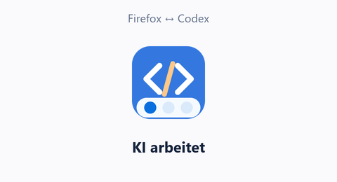
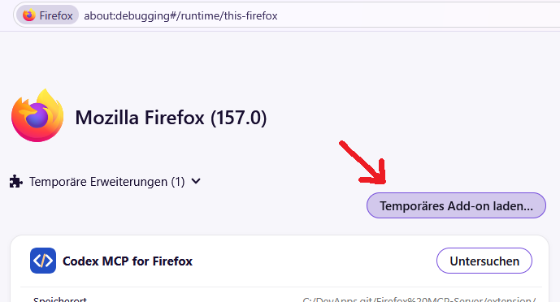
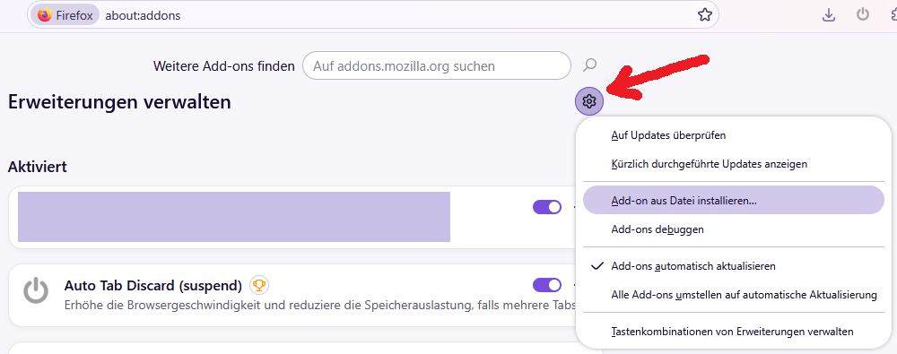
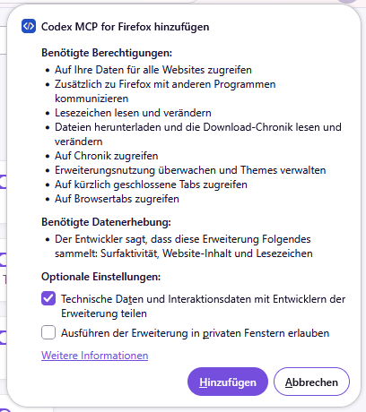
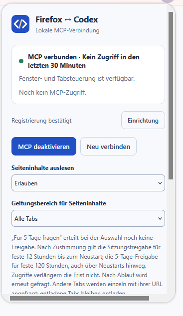
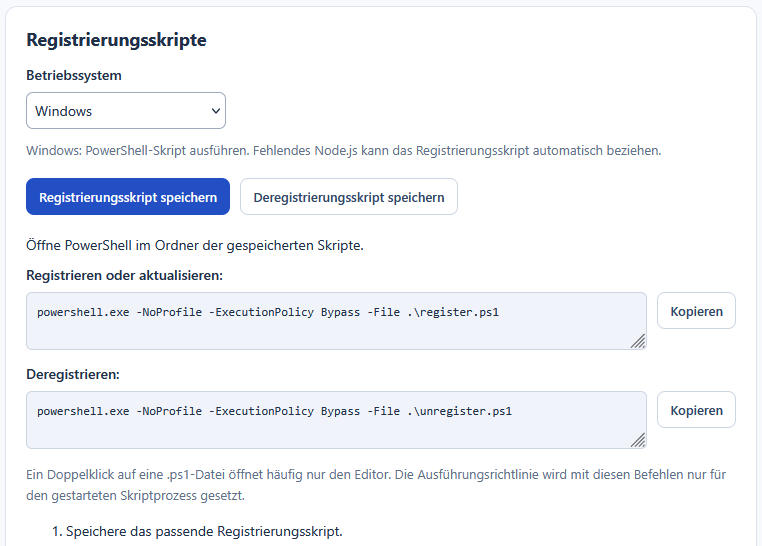

# Firefox MCP-Server for AI-Chats

Clients: Codex, Claude Code (CLI / VS Code), Claude Desktop, Eigent, Gemini CLI / Code Assist, ~~Gemini Desktop~~, Hermes, LM Studio and OpenClaw

Home: <https://geheimniswelten.github.io/#firefox-codex-mcp>

Download: <https://github.com/geheimniswelten/firefox-codex-mcp/releases>

> [!NOTE]
> Verschiebe alle Youtube-Videos mit XYZ im Titel in ein neues Fenster  
> Lösche doppelte Browser-Tabs  
> Finde im Browser den Tab mit den Katzenvideos und erstell dafür einen Favoriten  
> Suche in allen Browser-Tabs nach dem Sinn des Lebens und nenne mir die Antwort

Codex freut sich auf deine Befehle :kissing_closed_eyes:

  
<b>[EN] English</b>

  - **Manage Firefox with AI**: tabs, windows, history, bookmarks, favorites and extensions (search/browse/close/move/...)
    - Search tabs/history by title, URL and time range. Bookmarks and folders, including those on the bookmarks toolbar (find/create/edit/move/delete)
  - Installation:
    - Local/[temporary](Install-temporarily.png): build.cmd -> install.cmd -> 1 or 2+3 -> about:debugging#/runtime/this-firefox -> Load Temporary Add-on -> extension\manifest.json, dist\*.zip or *.xpi (remains installed until the next browser restart)
    - Manual/[permanent(xpi)](Install-XPI-manualy.png): about:addons -> [gear menu] -> Install Add-on from File... -> [*.xpi](https://github.com/geheimniswelten/firefox-codex-mcp/releases) -> Add-on Settings -> Setup -> run register.ps1
    - Online / Firefox Add-ons: currently unlisted (private) on [AMO](https://addons.mozilla.org/)
  - Desktop Firefox on Windows, Linux and macOS (a local native messaging helper is required)
  - Access to page content is blocked by default (permission is requested on first access)
  - Export web pages as PNG and single-file HTML (PDF export is also available, but only opens Firefox’s save dialog)
  - Debugging features: access page content, particularly to develop and test websites locally.

---

  
<b>[DE] Deutsch</b>

  - **Firefox mit KI verwalten**: Tabs/Fenster/Chronic/Lesezeichen/Favoriten/Plugins (suchen/durchsuchen/schließen/verschieben/...)
    - Tabs/Chronik nach Titel, URL und Zeitraum durchsuchen. Lesezeichen und Ordner einschließlich Symbolleiste (suchen/anlegen/bearbeiten/verschieben/löschen)
  - Inststallation:
    - lokal/[temporär](Install-temporarily.png): build.cmd -> install.cmd -> 1 or 2+3 -> about:debugging#/runtime/this-firefox -> Temmporätes Add-on laden -> extension\\manifest.json, dist\\*.zip or *.xpi (hält bis zum nächsten Neustart)
    - manuell-[permanent(xpi)](Install-XPI-manualy.png): about:addons -> [Optionen] -> Add-on aus Datei installieren... -> [*.xpi](https://github.com/geheimniswelten/firefox-codex-mcp/releases) -> Add-on Einstellungen -> Einrichtung -> register.ps1 ausführen
    - online / Firefox Add-ons: aktuell im [AMO](## "addons.mozilla.org") nicht öffentlich gelistet (privat)
  - Desktop-Firefox unter Windows, Linux und macOS (ein lokaler Native-Messaging-Helfer ist erforderlich)
  - Zugriff auf Seiteninhalte standardmäßig gesperrt (bei Erstzugriff wird nach Freigabe gefragt)
  - Export von Webseiten als PNG und Single-HTML (auch als PDF -> öffnet aber nur den Speichern-Dialog des Firefox)
  - Debugfunktionen: Zugriff auf Seiteninhalte, aber vor allem auch um lokal Webseiten zu entwickeln und zu testen.

---

 

Install Temporary:  

Install Permanent XPI:  

Install-Permissions:  

Options Menu:  

Register-Script:  

